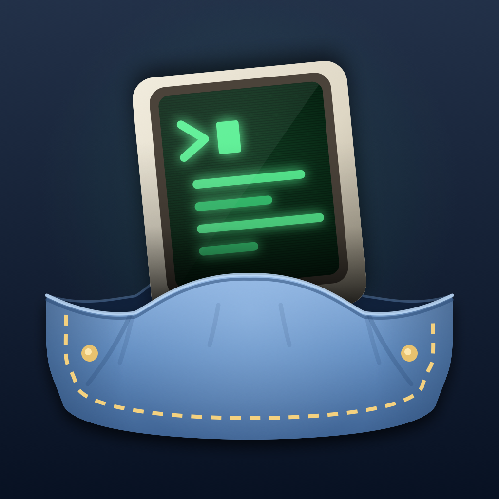
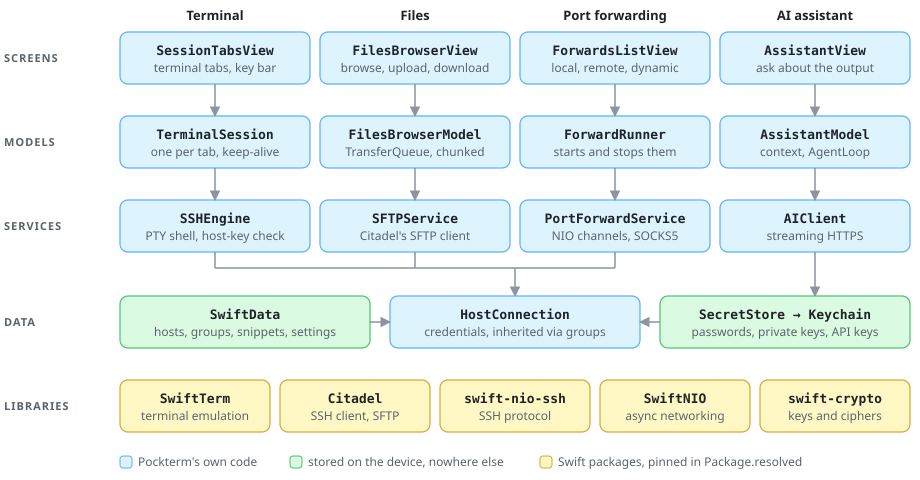
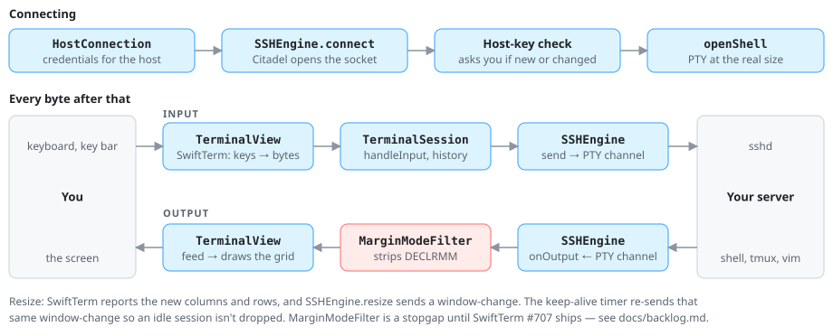

<div align="center">



# Pockterm

**A native SSH and SFTP client for iPhone. Free, open source, with no account and no tracking.**

[](https://apps.apple.com/app/id6789968094)
[](LICENSE)

</div>

---

Pockterm exists because none of the free iPhone terminals did what I wanted.
Full-screen console apps — `vim`, `htop`, `tmux`, anything drawing a TUI —
render properly instead of turning into garbled text.

## What it does

**Connect**
- SSH with passwords or Ed25519/RSA keys
- Host-key verification that warns you if a server's key ever changes
- Multiple live sessions; minimise one and pick it back up from the tab bar
- Configurable keep-alive so idle sessions stay open

**Transfer**
- Full SFTP browser for any saved host — no extra setup
- Uploads and downloads stream in chunks, so large files don't exhaust memory
- Upload straight from iCloud Drive; save downloads back to Files

**Manage**
- Organise hosts into nested groups that pass down credentials and settings
- Import hosts from an `~/.ssh/config`
- Reusable command snippets
- Generate SSH keys, or import your own, and keep them in the iOS Keychain
- Local, remote and dynamic (SOCKS) port forwarding

**AI assistant** *(optional, off by default)*
- Ask about terminal output and get suggested commands
- Bring your own API key: Anthropic, OpenAI, OpenRouter, or Hugging Face
- You're told which provider receives data before anything is sent

## Privacy

No account. No Pockterm servers. No analytics, no tracking, no ads.

Credentials and keys live in the iOS Keychain, and your connection data stays on
your device. The only network traffic is to the servers you configure — plus, if
you deliberately enable the AI assistant, the provider whose key you supplied.
The code is all here, so you don't have to take my word for any of that.

Full policy: [docs/privacy-policy.md](docs/privacy-policy.md)

## Requirements

iOS 18.0 or later, on iPhone or iPad.

## Building from source

### What you need

- A Mac with **Xcode 26.5 or later**. I build it with Xcode 27.0. The test
  target needs the iOS 26.5 SDK, which is where that floor comes from.
- Nothing else. There are no CocoaPods, no Homebrew packages and no build
  scripts to run first. Xcode fetches the twelve Swift packages itself; they're
  pinned in
  [`Package.resolved`](pockterm.xcodeproj/project.xcworkspace/xcshareddata/swiftpm/Package.resolved).
- An Apple developer account **only** if you want it on a real iPhone. The
  simulator needs no account and no signing changes.

### Run it in the simulator

```bash
git clone https://github.com/jhancock1975/pockterm.git
cd pockterm
open pockterm.xcodeproj
```

1. Wait for Xcode to finish fetching the packages. It takes a minute or so the
   first time.
2. Pick any iPhone simulator from the destination menu at the top of the window.
3. Press **⌘R**.

The first build fails with *Plugin "SwiftTermBuildInfoPlugin" from package
"SwiftTerm" must be enabled before it can be used.* That's a build plugin inside
[SwiftTerm](https://github.com/migueldeicaza/SwiftTerm), the terminal emulator.
All it does is stamp SwiftTerm's own git tag and commit into a generated Swift
file. Click the error in the Issue navigator, click **Trust & Enable** in the
dialog that opens, and press **⌘R** again.

### Or build from the command line

```bash
xcodebuild build -project pockterm.xcodeproj -scheme pockterm \
  -destination 'platform=iOS Simulator,name=iPhone 17' \
  -derivedDataPath build/DerivedData \
  -skipPackagePluginValidation

xcrun simctl boot 'iPhone 17'
open -a Simulator
xcrun simctl install booted build/DerivedData/Build/Products/Debug-iphonesimulator/pockterm.app
xcrun simctl launch booted John-Hancock.pockterm
```

`-skipPackagePluginValidation` is the command-line version of clicking
**Trust & Enable**. There's no other way past that prompt when running
headless. Use any simulator name that `xcrun simctl list devices available`
shows you.

From a clean clone, with nothing cached, that build takes about 40 seconds on
my M5 Max.

### Try it against a real server

The simulator shares the Mac's network, so the quickest server to hand is the
Mac itself. Turn on **System Settings → General → Sharing → Remote Login**, then
add a host in Pockterm with `localhost`, port `22`, and your Mac username and
password. `htop`, `vim` and `tmux` on your own Mac are a good test of the
terminal.

### Run it on your own iPhone

1. **Xcode → Settings → Accounts**: add your Apple ID. A free account works, but
   the app then stops launching after seven days until you build it again.
2. Select the **pockterm** target, then **Signing & Capabilities**:
   - **Team**: pick yours.
   - **Bundle Identifier**: change `John-Hancock.pockterm` to something of your
     own, such as `com.yourname.pockterm`. The original belongs to my team, and
     Xcode won't sign it for anyone else's.
3. On the iPhone, turn on **Settings → Privacy & Security → Developer Mode**,
   connect it, and pick it as the destination.
4. Press **⌘R**. With a free account, the first launch is blocked until you
   trust your certificate in **Settings → General → VPN & Device Management**.

Please keep your team and bundle identifier changes out of any pull request.

### Run the tests

```bash
scripts/test.sh --build   # compile, then run the unit tests (~2 min cold)
scripts/test.sh           # re-run against the last build (seconds)
```

The tests use Swift Testing. The script exists because
plain `xcodebuild test` often hangs for ten minutes *after* the tests have
finished. It spots that, and it fails a stuck test in about a minute instead of
waiting for iOS's ten-minute watchdog. Trust its **exit status**, not the output: pipe
it through `tail` and a failure reads as a pass.

It runs on a simulator called *iPhone 17*. If you don't have one:

```bash
TEST_DESTINATION='platform=iOS Simulator,name=iPhone 16' scripts/test.sh --build
```

## How it's put together

<picture>
  <source media="(prefers-color-scheme: dark)" srcset="docs/images/architecture-dark.svg">
  
</picture>

The terminal is the part that took the most work. Here's what happens to the
bytes:

<picture>
  <source media="(prefers-color-scheme: dark)" srcset="docs/images/terminal-data-flow-dark.svg">
  
</picture>

The diagrams are generated. Edit `scripts/build-diagrams` and re-run it rather
than editing the SVGs.

### Where things are

| Path | What's in it |
|---|---|
| `pockterm/App` | App entry point, root tab bar, and `AppContainer`, which wires SwiftData and the Keychain together |
| `pockterm/Features/` | One folder per screen: SwiftUI views and the models behind them |
| `pockterm/Features/Terminal` | Sessions, the key bar, themes, zoom, keep-alive, and `MarginModeFilter` |
| `pockterm/SSH` | `SSHEngine`, credential resolution, host-key checks |
| `pockterm/SFTP` | `SFTPService` and the transfer queue |
| `pockterm/Forwarding` | Local, remote and SOCKS5 forwarding on SwiftNIO |
| `pockterm/Vault` | `SecretStore` (Keychain in the app, in-memory in tests), known hosts, settings inherited through groups |
| `pockterm/Crypto` | Ed25519 key generation, and importing OpenSSH-format private keys |
| `pockterm/Model` | SwiftData models |
| `pockterm/AI` | Provider clients, streaming decoder, agent loop, command risk classifier |
| `pockterm/Import` | `~/.ssh/config` parser |
| `pockterm/Localizable.xcstrings` | Every UI string, in all 15 languages |
| `pocktermTests/` | Unit tests |
| `scripts/` | Test runner, dependency audit, and the generators for the website, manual and these diagrams |
| `docs/` | Backlog, dependency policy, privacy policy, and the design notes each feature started from |

Built on [SwiftTerm](https://github.com/migueldeicaza/SwiftTerm) for terminal
emulation and [Citadel](https://github.com/orlandos-nl/Citadel) for SSH.

## Contributing

Bug reports and pull requests are welcome, through
[Issues](https://github.com/jhancock1975/pockterm/issues).

- **Run `scripts/test.sh --build` before you open a PR**, and add a test for
  whatever you fixed if it can be tested without a network.
- **Adding a dependency is a big deal here.** This app holds people's server
  credentials and private keys, so every package has to come from a source
  someone has vetted. Read [docs/dependency-policy.md](docs/dependency-policy.md)
  first. `scripts/routine-update` enforces it.
- New UI strings go in `Localizable.xcstrings`. If you can't translate them,
  leave them in English and I'll sort out the other fourteen.

## Status

Free, and staying that way. Actively developed — see
[docs/backlog.md](docs/backlog.md) for what's next, and
[Issues](https://github.com/jhancock1975/pockterm/issues) for bugs and requests.

## Licence

Apache License 2.0 — see [LICENSE](LICENSE). Third-party components and their
licences are listed in [NOTICE](NOTICE); all are Apache-2.0 or MIT.
